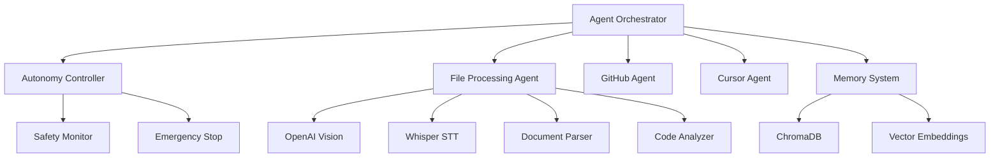

# 🚀 LazyCoder - Autonomous AI Agent for Cursor IDE

**LazyCoder** is an advanced autonomous AI agent with "God Mode" capabilities designed specifically for Cursor IDE. The system offers intelligent automation of programming tasks with full integration of the OpenAI API, GitHub, and an advanced file processing system.

## ✨ Key Features

### 🤖 Autonomy System
- **4 control levels**: Manual, Semi-Auto, Full-Auto, Dry-Run
- **Dynamic switching** of autonomy levels in real time
- **Emergency Stop** - immediate halt of all operations
- **Rollback** - revert changes in case of errors

### 📁 Advanced File Processing
- **Images**: OCR, UI analysis, object detection (OpenAI Vision)
- **Documents**: PDF, DOCX, TXT, MD - text extraction and content analysis
- **Audio**: Whisper transcription, audio feature analysis
- **Code**: Function analysis, complexity, imports, refactoring
- **AI-powered insights** for development context

### 🔗 GitHub Integration
- Automatic repository management
- Creating issues, PRs, commits
- Integration with CI/CD workflows
- Project synchronization

### 🎮 Cursor IDE Automation
- GUI control via Playwright
- Integration with chat system
- Automatic file opening and code editing
- Workspace synchronization

## 🛠️ Installation

### Requirements
- Python 3.8+
- Cursor IDE
- API keys: OpenAI, GitHub (optional: Anthropic, Google)

### Quick Installation

```bash
# Clone the repository
git clone https://github.com/lazycoder/lazycoder.git
cd lazycoder

# Install dependencies
pip install -r requirements.txt

# Install the package
pip install -e .

# Configure environment variables
cp .env.example .env
# Edit .env and add your API keys
```

### Configuration

1. **Copy and edit the configuration file**:
```bash
cp .env.example .env
```

2. **Add your API keys in the `.env` file**:
```env
OPENAI_API_KEY=sk-your-openai-api-key-here
GITHUB_TOKEN=ghp_your-github-token-here
CURSOR_WORKSPACE_PATH=/path/to/your/cursor/workspace
```

3. **Optionally adjust settings in `config/settings.yaml`**

## 🚀 Usage

### Starting the Agent

```bash
# Start with default configuration
lazycoder start

# Start with a specific autonomy level
lazycoder start --autonomy semi_auto

# Start with a custom configuration
lazycoder start --config /path/to/config.yaml
```

### File Processing

```bash
# Analyze a single file
lazycoder process-file document.pdf

# Analysis with context
lazycoder process-file image.png --context "UI mockup for login page"

# Code analysis
lazycoder process-file app.py --context "Main application file"
```

### Autonomy Management

```bash
# Change autonomy level
lazycoder set-autonomy full_auto

# Emergency stop
lazycoder emergency-stop

# System status
lazycoder status
```

## 🎯 Autonomy Levels

### 🔧 Manual
- User confirms every action
- Full control over all operations
- Ideal for learning and testing

### ⚡ Semi-Auto
- Automatic execution of safe actions
- Confirmation required for risky operations
- Balance between automation and control

### 🚀 Full-Auto
- Full autonomy with safety checks
- Automatic execution of all actions
- Maximum productivity

### 🧪 Dry-Run
- Simulates actions without execution
- Ideal for testing and debugging
- Safe experimentation

## 📊 Usage Examples

### UI Image Analysis
```python
# The agent automatically:
# 1. Detects UI elements in the image
# 2. Extracts text via OCR
# 3. Generates HTML/CSS code based on the mockup
# 4. Creates React/Vue components
```

### Documentation Processing
```python
# The agent automatically:
# 1. Extracts requirements from PDF
# 2. Creates issues on GitHub
# 3. Generates code based on the specification
# 4. Updates documentation
```

### Audio/Video Analysis
```python
# The agent automatically:
# 1. Transcribes meeting recordings
# 2. Extracts action items
# 3. Creates project tasks
# 4. Generates summaries
```

## 🏗️ Architecture



## 🔧 Advanced Configuration

### Customizing Autonomy Levels
```yaml
autonomy:
  levels:
    custom_level:
      description: "Custom autonomy level"
      auto_execute: true
      require_confirmation_for: ["git_push", "file_deletion"]
      safety_checks: true
```

### File Processing Configuration
```yaml
file_processing:
  analysis:
    use_openai_vision: true
    use_whisper: true
    generate_summaries: true
    extract_entities: true
    code_complexity_analysis: true
```

### Security
```yaml
security:
  whitelist:
    domains: ["github.com", "api.openai.com"]
    file_extensions: [".py", ".js", ".md"]
  blacklist:
    commands: ["rm -rf", "sudo"]
    paths: ["/etc", "/usr"]
```

## 🧪 Testing

```bash
# Run tests
pytest tests/

# Integration tests
pytest tests/integration/

# Tests with coverage
pytest --cov=src tests/
```

## 📚 API Reference

### AgentOrchestrator
```python
from lazycoder import AgentOrchestrator

orchestrator = AgentOrchestrator(config)
await orchestrator.initialize()

# Create a task
task_id = orchestrator.create_task(
    name="Process file",
    agent_type="file_processing",
    action="process_file",
    parameters={"file_path": "document.pdf"}
)
```

### FileProcessingAgent
```python
from lazycoder.agents import FileProcessingAgent

agent = FileProcessingAgent(config)
result = await agent.process_file("image.png", context="UI mockup")

print(f"Insights: {result.content_analysis.insights}")
print(f"Summary: {result.content_analysis.summary}")
```

## 🤝 Contributing

1. Fork the repository
2. Create a branch for your new feature (`git checkout -b feature/amazing-feature`)
3. Commit your changes (`git commit -m 'Add amazing feature'`)
4. Push to the branch (`git push origin feature/amazing-feature`)
5. Open a Pull Request

## 📄 License

This project is licensed under the MIT License - see the [LICENSE](LICENSE) file for details.

## 🆘 Support

- 📖 [Documentation](https://docs.lazycoder.dev)
- 🐛 [Report bugs](https://github.com/lazycoder/lazycoder/issues)
- 💬 [Discussions](https://github.com/lazycoder/lazycoder/discussions)
- 📧 [Email](mailto:support@lazycoder.dev)

## 🙏 Acknowledgements

- [OpenAI](https://openai.com) for the GPT-4 and Whisper APIs
- [Cursor](https://cursor.sh) for the amazing IDE
- [LangChain](https://langchain.com) for the AI framework
- The open source community for inspiration

---

**Built with ❤️ for developers by developers**

🌟 **If LazyCoder helped you at work, leave a star on GitHub!** 🌟